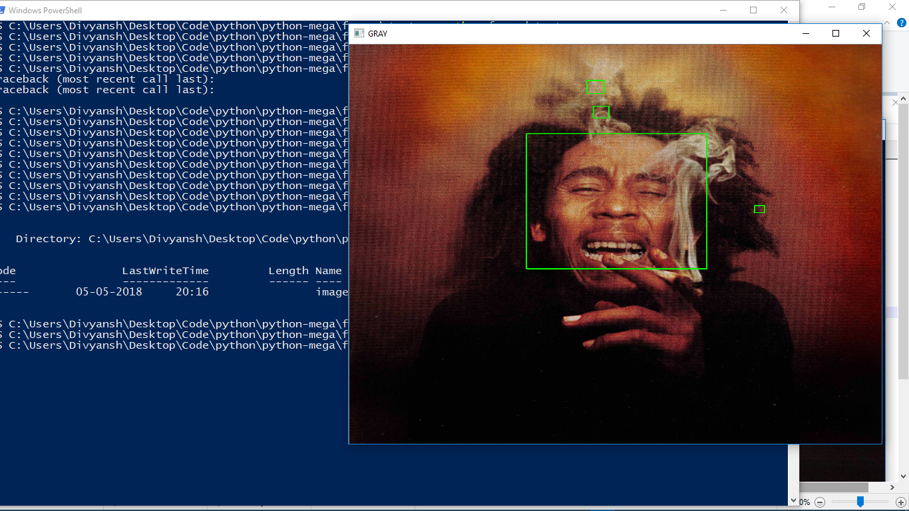

# Face Detector

A face Detector made in python

## Getting Started
```
* Clone the repo.
* run face_detector.py
```

### Prerequisites

What things you need to install the software and how to install them

```
* Python 3
* openCV
```

## Built With

* [Python3](https://www.python.org) - The programming language
* [Open CV](https://www.opencv.og) - The image processing library

## Authors

* **Divyansh Dwivedi** - *Initial work*

## Screenshot





